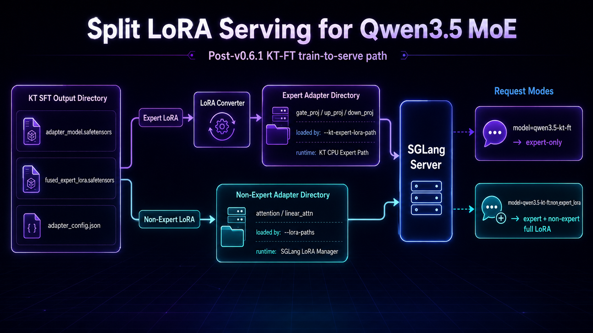
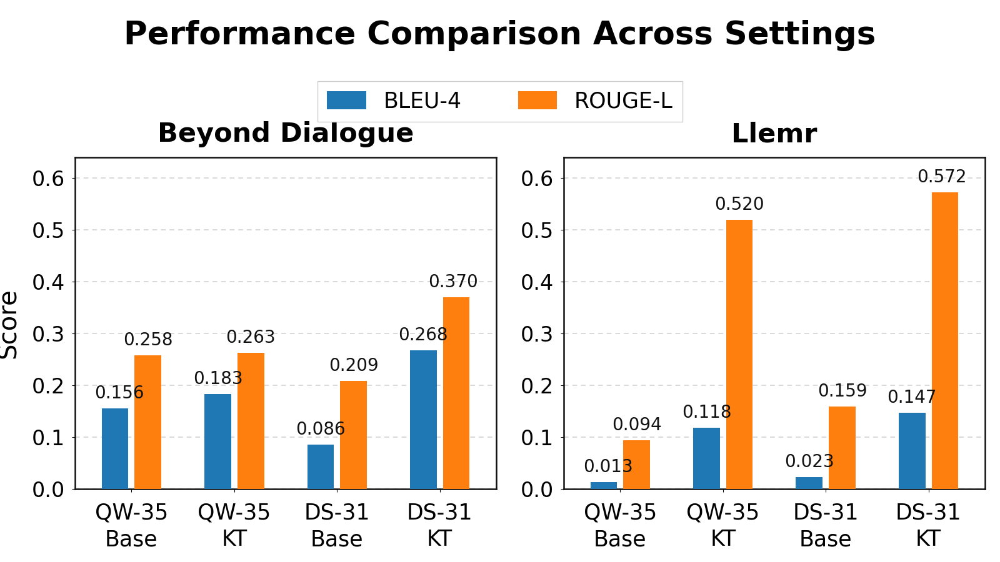

Previously, we published a guide on using [KTransformers, LLaMA-Factory, and SGLang](https://kvcache.ai/blog/ktransformers-llamafactory-fine-tuning/) for low-cost local fine-tuning and inference. This post does not replace it; it focuses on what changed with KT-FT v0.6.1 and how the post-v0.6.1 serving work closes the end-to-end loop.

The goal is no longer only to run MoE SFT locally. It is to connect the whole path: fit MoE SFT on local hardware, carry the trained adapter into SGLang, and evaluate it through an OpenAI-compatible serving API. MoE training has two bottlenecks—making the job fit (GPU for attention, CPU for experts) and making the trained adapter usable in a real serving stack. v0.6.1 targets both while keeping the LLaMA-Factory training surface unchanged.

<center>

</center>

## What v0.6.1 improves

The main change in v0.6.1 is the MoE SFT backend itself. Compared with earlier KT fine-tuning paths, the refactor targets three practical concerns: training speed, memory pressure, and setup friction.

In measured configurations against a ZeRO-Offload baseline, KT SFT reaches roughly 6–12x training performance. CPU memory usage drops to about half, and GPU memory is reduced further. This makes longer contexts easier to fit on the same hardware.

Results vary by model, hardware, and LoRA setup; release benchmarks will include the full configuration context.

The installation process is also cleaner. v0.6.1 collects the SFT dependency entry under:

```bash
pip install "ktransformers[sft]==0.6.1"
```

That entry installs the KT SFT components needed underneath LLaMA-Factory, including `ktransformers`, `kt-kernel`, `transformers-kt`, and `accelerate-kt`. For LLaMA-Factory users, the preferred path is still to use a checkout that includes the KT examples and `requirements/ktransformers.txt`; the integration work is tracked in [LLaMA-Factory PR #10430](https://github.com/hiyouga/LLaMA-Factory/pull/10430).

We also published a separate [v0.6.1 Quick Start](https://github.com/kvcache-ai/ktransformers/blob/main/doc/en/SFT/KTransformers-Fine-Tuning_Quick-Start.md), which readers can refer to.

Under the hood, v0.6.1 keeps the same LLaMA-Factory workflow but changes placement: attention stays on GPU with LoRA attached, routed experts can live in CPU memory, and expert computation is still exposed to PyTorch autograd so gradients can flow through the SFT job.

<center>

</center>

## Beyond Quick Validation: SGLang Adapter Serving After v0.6.1

The earlier guide already covered the immediate post-training sanity check: load the adapter back into LLaMA-Factory, run a few interactive prompts, and confirm that the adapter can be used. That step is still useful. It answers a narrow but important question: did the adapter load, and does the target behavior appear?

For an end-to-end fine-tuning-to-serving loop, that is not enough. The adapter also needs to run in the same kind of environment used for benchmark traffic, automated evaluation, and application-facing APIs. In this workflow, that environment is SGLang.

For Qwen3.5 MoE, the post-v0.6.1 bridge is `kt-kernel/scripts/convert_kt_to_sglang_adapter.py` plus a **split** serving layout: expert LoRA through KT, non-expert LoRA through SGLang’s normal LoRA manager.

### What KT SFT actually writes

A typical LLaMA-Factory + KT SFT output directory contains two LoRA artifacts, not one:

```text
<KT_SFT_OUTPUT_DIR>/
  adapter_model.safetensors      # non-expert LoRA (PEFT keys, attention / linear_attn)
  fused_expert_lora.safetensors  # expert LoRA (KT fused format)
  adapter_config.json            # training metadata (rank, alpha, target_modules, ...)
```

Do not treat `adapter_model.safetensors` alone as the full fine-tuned adapter for Qwen3.5 MoE serving. Expert weights live in `fused_expert_lora.safetensors` until they are converted for SGLang.

<center>

</center>

### Why serving is split

* **Expert LoRA** (`gate_proj`, `up_proj`, `down_proj`) — `--kt-expert-lora-path`, KT CPU expert forward path.
* **Non-expert LoRA** (attention / linear attention) — `--lora-paths`, SGLang LoRA manager.

### Convert once from the raw KT-SFT directory

Run `convert_kt_to_sglang_adapter.py` once on the training output with `--expert-output-dir` and `--nonexpert-output-dir`. The second positional argument is a merged adapter directory (legacy/debug); for split serving, use only the two split directories with SGLang.

| Output | Use in split serving |
| --- | --- |
| `<EXPERT_ADAPTER_DIR>` | `--kt-expert-lora-path` |
| `<NONEXPERT_ADAPTER_DIR>` | `--lora-paths <name>=...` |
| `<MERGED_ADAPTER_DIR>` | Debug only; not the split-runtime contract |

```bash
python kt-kernel/scripts/convert_kt_to_sglang_adapter.py \
  saves/KT_FT_qwen35B_Moe_nekoqa_eod_240 \
  saves/KT_FT_qwen35B_Moe_nekoqa_eod_240_sglang \
  --base-model-name-or-path /path/to/Qwen3.5-35B-A3B \
  --expert-output-dir saves/KT_FT_qwen35B_Moe_nekoqa_eod_240_expert_adapter \
  --nonexpert-output-dir saves/KT_FT_qwen35B_Moe_nekoqa_eod_240_nonexpert_adapter \
  --overwrite
```

You should see summary lines similar to: merged ~61k tensors; expert-only ~61k tensors; non-expert-only ~380 tensors, with `target_modules` limited to `gate_proj/up_proj/down_proj` vs attention/linear-attn names respectively.

Quick pre-serve check (optional):

```bash
python - <<'PY'
import json
from pathlib import Path

expert = Path("<EXPERT_ADAPTER_DIR>")
nonexpert = Path("<NONEXPERT_ADAPTER_DIR>")

expert_cfg = json.loads((expert / "adapter_config.json").read_text())
nonexpert_cfg = json.loads((nonexpert / "adapter_config.json").read_text())

assert {"gate_proj", "up_proj", "down_proj"} <= set(expert_cfg["target_modules"])
assert not ({"gate_proj", "up_proj", "down_proj"} & set(nonexpert_cfg["target_modules"]))
assert (expert / "adapter_model.safetensors").is_file()
assert (nonexpert / "adapter_model.safetensors").is_file()
print("ok")
PY
```

### Launch and request semantics

```bash
python -m sglang.launch_server \
  ... \
  --kt-expert-lora-path <EXPERT_ADAPTER_DIR> \
  --enable-lora \
  --lora-backend triton \
  --lora-paths <NONEXPERT_LORA_NAME>=<NONEXPERT_ADAPTER_DIR> \
  --served-model-name <SERVED_MODEL_NAME>
```

Request behavior:

```text
model=<SERVED_MODEL_NAME>
=> base + KT expert LoRA (always on at startup)

model=<SERVED_MODEL_NAME>:<NONEXPERT_LORA_NAME>
=> base + KT expert LoRA + SGLang non-expert LoRA
```

On the expert side, serving reuses the SFT-compatible path without training state (`forward_sft(save_for_backward=False)`). The trained adapter can be evaluated locally without pre-merging expert weights into the base model.

Repository reference for the full Qwen3.5 loop: `ktransformers/doc/en/SFT/Qwen3.5-SGLang-LoRA-Serving.md` (launch flags, constraints, smoke tests). If you are comparing versions, use the **split-output** flags above with the current converter.

## Did the adapter actually take effect?

There are two different questions here, and it is useful not to mix them.

The first is whether KT-backed SFT can train a meaningful adapter. We tested this on representative adaptation workloads including [Beyond Dialogue](https://aclanthology.org/2025.acl-long.586/) for personalized chat and [Llemr](https://papers.nips.cc/paper_files/paper/2024/hash/62986e0a78780fe5f17b495aeded5bab-Abstract-Datasets_and_Benchmarks_Track.html) for EHR-domain adaptation. These are small-scale evaluations rather than universal claims, but they show that KT supports real adapter training rather than only loading a huge model for a demo.

<center>

</center>

The second question is whether the serving path applies the trained adapter correctly. In local NekoBench-style validation with Qwen3.5, the split LoRA serving path changed model behavior in the expected direction for a narrow personality/style adapter. The overall mean moved from 3.61 to 4.37, with stronger gains on persona and companionship-style slices. Knowledge and reasoning slices dropped, which is also expected for a narrow style-oriented adapter.

That is the intended claim: the serving path makes the adapter take effect. It does not mean every capability improves after a style fine-tune.

In practice, this is where the end-to-end loop matters: serving lets you measure adapter behavior beyond a few interactive prompts. If the adapter improves the intended behavior but hurts unrelated capability slices, you can compare dataset mix, LoRA target, rank, learning rate, or evaluation set against the same local API environment used for downstream testing.

## How this post relates to the earlier guide

| Topic | Earlier kvcache guide | This post (v0.6.1 + Qwen3.5 serving) |
| --- | --- | --- |
| Training UI | LLaMA-Factory YAML, familiar outputs | Same surface; KT MoE SFT backend refactor underneath |
| Post-train check | Load adapter in LLaMA-Factory, a few prompts | Still valid as a quick sanity check |
| Adapter on disk | Often described as one adapter directory | KT MoE: **two** training artifacts (`adapter_model` + `fused_expert_lora`) |
| Convert for SGLang | Not the focus of the original guide | `convert_kt_to_sglang_adapter.py` with split output dirs |
| SGLang launch | Single adapter via `--lora-paths lora0=...` | Split: `--kt-expert-lora-path` + `--lora-paths <name>=...` |
| Full adapter at request time | Request `model=...:lora0` | Request `model=<base>:<nonexpert_name>`; expert LoRA is always loaded at startup |

For environment setup, LLaMA-Factory + KT training, and the generic single-LoRA SGLang path, see the [earlier guide](https://kvcache.ai/blog/ktransformers-llamafactory-fine-tuning/). **This post** covers what changed afterward: the v0.6.1 MoE SFT backend and the Qwen3.5 split adapter path (converter and launch flags above).

## Closing

v0.6.1 moves KTransformers fine-tuning from “possible on a workstation” toward a cleaner SFT workflow.

The backend refactor improves training performance and memory usage. The `ktransformers[sft]` entry lowers setup friction. The package boundary cleanup makes it clearer which components belong to SFT and which belong to inference. LLaMA-Factory remains the familiar training interface, while KTransformers provides the heterogeneous execution backend underneath.

The post-v0.6.1 serving work closes the next gap: moving the trained adapter into SGLang without pre-merging expert weights into the base model. Run `convert_kt_to_sglang_adapter.py` on the raw KT-SFT output with `--expert-output-dir` and `--nonexpert-output-dir`, then launch with the split flags above.

That is the KT-FT loop: train the adapter, validate it, serve it locally with SGLang, measure the behavior, revise the data or LoRA settings, and run again.

If you can run the model with KTransformers, you should be able to tune it. With the v0.6.1 SFT refactor and the post-v0.6.1 serving bridge, you can also test what you tuned in the same local environment.
