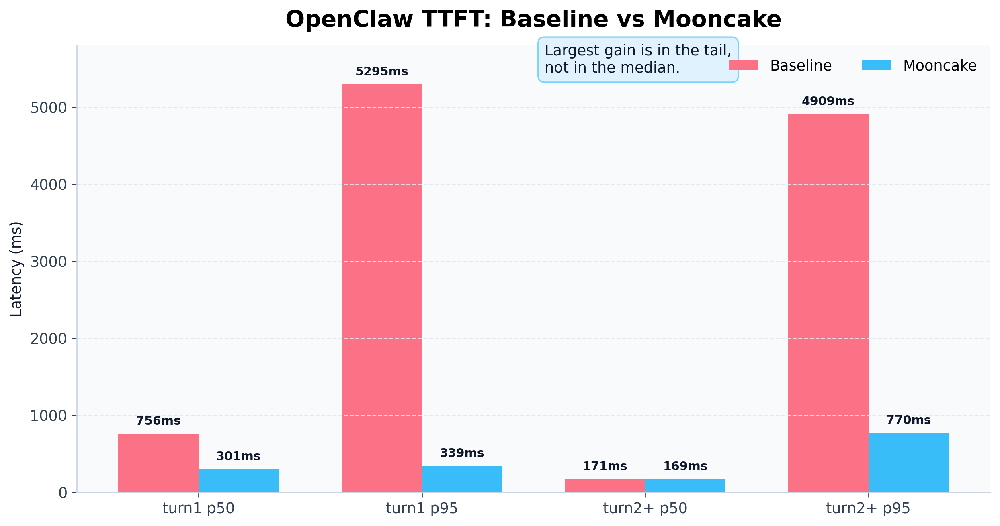
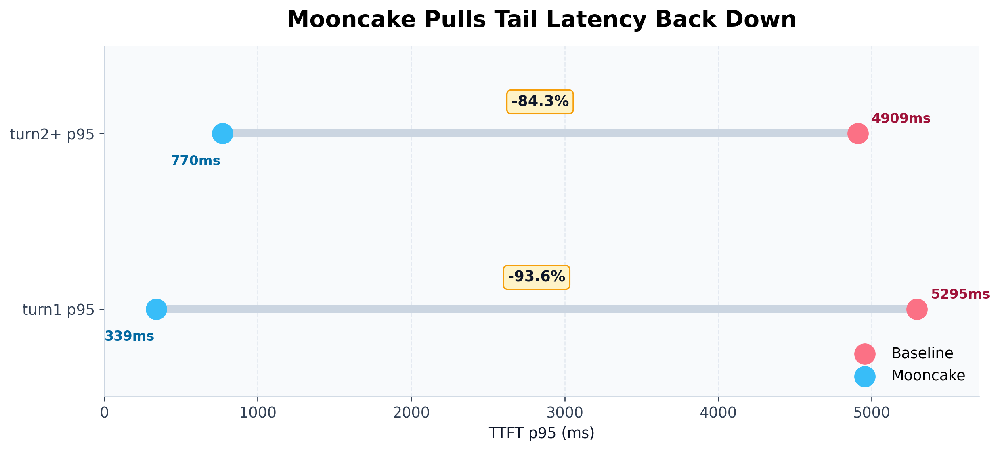
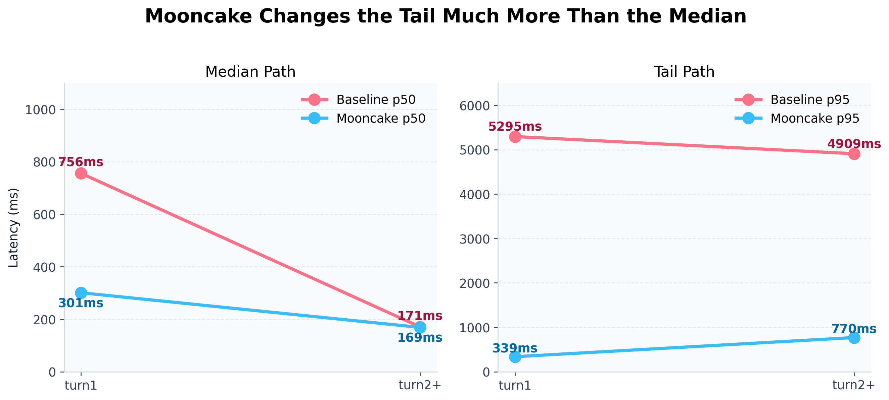
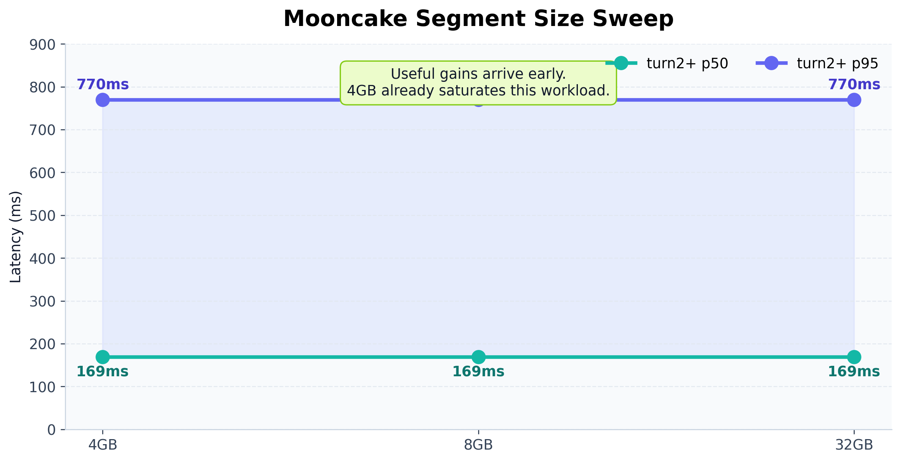

Some performance wins are obvious at first glance.

Lower average latency. Higher throughput. Faster time-to-first-token. Those are the numbers that look great in benchmark tables, and they are easy to compare across systems.

But there is another kind of improvement that matters just as much in real usage.

It does not make the system "even faster at its best." It makes the system much less likely to suddenly stall when you keep using it across multiple sessions, with longer histories, over multiple turns.

If you interact with AI systems continuously, you already know how big that difference feels.

Sometimes a system is not broadly slow. It is just *occasionally* slow. Most turns feel fine, and then one reply suddenly pauses for three or five seconds. In that moment, the experience shifts from "this feels smooth" to "why did it hang again?"

That kind of problem does not always stand out in single-turn benchmarks. It can even be easy to miss in lab-style testing. But in real multi-session workloads, it becomes one of the most important parts of perceived performance.

We recently integrated Mooncake into OpenClaw's inference path and ran a focused validation around exactly this question.

The result was straightforward:

**The biggest change Mooncake brings is not shaving a little more time off already-fast requests. It is pulling the worst tail-latency spikes sharply back down.**

In other words:

**OpenClaw is not only faster. More importantly, it is much more stable.**

## Why this upgrade is worth talking about

When people talk about model performance, the conversation naturally gravitates toward two things:

- averages
- best-case or peak numbers

The first tells you whether a system feels fast overall. The second tells you whether a benchmark chart looks impressive.

But for systems that people actually use, a third metric often matters more: the tail.

Users do not talk to your system in percentiles. They remember two things:

- whether it usually feels responsive
- whether it falls apart at the wrong moment

If a system feels fast most of the time but occasionally freezes for several seconds, the verdict is rarely "the average latency looks good." It is usually just: "it feels a bit unstable."

That is why we do not think a system like OpenClaw, built for real sustained interaction, can be judged on the fast path alone. Fast paths matter, but **the upper bound of the slow path** often matters even more to the actual experience.

That was the real question behind this Mooncake integration:

In a realistic workload with multiple sessions, long histories, and continuous turn-taking, can Mooncake suppress the slow outliers that users actually notice?

Our answer was yes.

And not in a marginal way. This is the kind of change you can see immediately once you look at the latency profile.

## The headline result: this is a stability upgrade

If we had to summarize the outcome in one sentence, it would be this:

**Mooncake does not meaningfully change how fast the fastest requests can be. It changes how slow the slowest requests are allowed to get.**

That is not rhetoric. It is the central observation from this round of testing.

In the baseline configuration, `OpenClaw + SGLang`, the median path is already decent. The real issue is not the requests that complete smoothly. It is the smaller set of requests that occasionally stretch far into the tail.

After enabling Mooncake, those spikes are dramatically flattened.

On a chart, that shows up as performance. In a product, it shows up as fluidity. For users, it shows up as a much simpler sentence:

**"This feels way smoother now."**

## We kept the real OpenClaw path intact

Performance evaluations often become more flattering as the stack gets simplified. The real application path is stripped away until the result is effectively a model-only benchmark, far from the product that users actually touch.

We did not want to do that here.

If the goal is to understand Mooncake's real value inside OpenClaw, then the right thing to test is OpenClaw's real path, not an idealized subcomponent in isolation.

So in this round, we kept:

- the OpenClaw Gateway entry point
- session routing
- prompt assembly
- provider invocation
- multi-session rotation
- long-context pressure

That means the workload still travels through essentially the same path that real users hit when they access a model through OpenClaw.

At a high level, the path looks like this:

`Client Request -> OpenClaw Gateway -> Session Routing -> Prompt Assembly -> SGLang -> Mooncake HiCache -> First Visible Token`

That detail matters. It means the gains we are reporting are not confined to a toy setup. They are already visible in OpenClaw's real inference chain.

## We removed the noise that would hide the inference story

Keeping the real path does not mean measuring everything at once.

For this test, we intentionally removed tool-path noise first.

If tool calls, tool execution time, and result post-processing are mixed into the same measurement, what you get is a broad end-to-end product number. That can be useful, but it makes it much harder to see what Mooncake is actually doing during multi-session inference itself.

So we used a pure-text setup:

- requests still enter through OpenClaw Gateway
- multi-session rotation is preserved
- long context is preserved
- tools are disabled
- the main metric is TTFT for the first visible token

We also controlled for Qwen3's output behavior by enabling `/no_think` in the system prompt, so the measurement reflects the moment users first see output rather than hidden reasoning tokens that are not visible in the UI.

In plain terms, this benchmark is meant to capture:

**the part of the real OpenClaw path that is closest to the GPU inference critical path.**

That is why this round says more about Mooncake itself than a noisier end-to-end product evaluation would.

## The setup is simple, but it looks like real usage

We did not choose an exaggerated stress setup designed only to produce dramatic numbers. Instead, we used a configuration that is much closer to how sustained interaction actually feels:

- model: `Qwen3-14B`
- `2` independent sessions
- `4` turns per session
- round-robin progression across sessions
- roughly `24000` characters of context in the first turn
- roughly `8000` additional characters added on each later turn
- `1` warmup round and `3` measured rounds per configuration
- primary metric: time to first visible token

This matters because the setup is neither a best-case single-session toy run nor a purely adversarial stress test.

It sits in the middle, where real product behavior starts to show:

multiple sessions are advancing at once, each session carries growing history, and the system has to keep switching between them while still feeling responsive.

That is exactly the environment OpenClaw has to handle.

## Baseline: not slow overall, but not stable enough

Let us start with the baseline, `OpenClaw + SGLang`.

These are the key numbers:

| Configuration | turn1 TTFT p50 | turn1 TTFT p95 | turn2+ TTFT p50 | turn2+ TTFT p95 |
| --- | ---: | ---: | ---: | ---: |
| OpenClaw + SGLang | 756ms | 5295ms | 171ms | 4909ms |

If you only look at `turn2+ p50 = 171ms`, the system already looks pretty good.

That is not the wrong conclusion. The median path really is not bad.

The problem is that users do not only encounter p50. They also encounter p95.

When requests fall into the tail, they are not just a little slower. They jump all the way into the `4s` to `5s` range. In sustained dialogue, that kind of pause is easy to notice and easy to resent.

So the baseline problem is not "everything is slow." It is this:

**the fast path is already fast, but the slow path is still much too slow.**

Figure 1. TTFT comparison across the most important checkpoints. The median path is already decent in the baseline, but Mooncake dramatically compresses the tail.

For a real product, this "good median, heavy tail" state is often the most frustrating one. It does not make the system feel broken all the time. It makes the experience oscillate between "pretty good" and "why did it stall again?"

## After Mooncake, the system starts to feel different

We then evaluated three Mooncake configurations:

- `4GB`
- `8GB`
- `32GB`

The pattern was strikingly consistent across all three:

| Configuration | turn1 TTFT p50 | turn1 TTFT p95 | turn2+ TTFT p50 | turn2+ TTFT p95 |
| --- | ---: | ---: | ---: | ---: |
| Mooncake 4GB | 301ms | 339ms | 169ms | 770ms |
| Mooncake 8GB | 303ms | 339ms | 169ms | 770ms |
| Mooncake 32GB | 306ms | 339ms | 169ms | 770ms |

Compared with the baseline, this is not a story about shaving another `10ms` or `20ms` from an already-optimized path.

It is a story about changing the shape of the latency distribution:

- `turn1 p95: 5295ms -> 339ms`
- `turn2+ p95: 4909ms -> 770ms`

while at the same time:

- `turn2+ p50: 171ms -> 169ms`

That is the most important point from this round.

**Mooncake is not simply making the fast path faster. It is making the slow path far less slow.**

Figure 2. The largest gains are in the tail. Mooncake pulls the worst-case experience back toward the median, which is exactly what users feel in continuous interaction.

In a technical table, that can look less dramatic than a headline-grabbing median speedup. In actual product usage, though, the value is immediate:

- fewer stalls
- less waiting
- fewer breaks in conversational rhythm
- a more continuous interaction loop

Users do not want a system that is occasionally spectacular. They want one that feels consistently smooth.

That is the direction Mooncake pushes OpenClaw toward.

## What really changes is the multi-session feel

Why keep emphasizing multi-session workloads?

Because many systems look fine when they are tested in a single short-context conversation. The real issues start to surface when multiple sessions advance in parallel and context keeps accumulating over time. That is when cache contention, state switching, and prefix rebuild costs become visible.

For a system like OpenClaw, that is not an edge case. That is the main battlefield.

Real users do not ask one question and disappear. They keep going. They switch topics. They jump across sessions. They push the system into the "sustained use" regime where stability matters.

That is also where Mooncake becomes easiest to appreciate:

- switching across sessions feels smoother
- first visible token arrival stays more predictable as context grows
- interaction rhythm becomes easier to maintain
- the system feels more continuously available instead of occasionally pausing

Figure 3. Mooncake changes the profile much more strongly at p95 than at p50. That is exactly why the perceived upgrade is larger than a simple median-only view would suggest.

This is hard to summarize as just "better average latency." It feels more like a transition from "it works" to "it is pleasant to use."

## Another pleasant surprise: 4GB is already enough to feel it

One more result stood out in this evaluation.

As Mooncake moves from `4GB` to `8GB` to `32GB`, the core metrics barely change under this workload:

| Mooncake segment size | turn2+ TTFT p50 | turn2+ TTFT p95 |
| --- | ---: | ---: |
| 4GB | 169ms | 770ms |
| 8GB | 169ms | 770ms |
| 32GB | 169ms | 770ms |

That tells us something important:

**Mooncake's benefits show up early.**

It does not require an especially heavy configuration before the gains become visible. From an engineering adoption perspective, that is very good news:

- it is easier to try
- the configuration envelope is friendlier
- the benefit-cost balance appears early
- the integration barrier is lower

Many technical solutions look strong on paper but require too much weight before they become worthwhile in practice.

Here, the story is almost the opposite: the gains arrive surprisingly early.

Figure 4. Under this workload, the result is already saturated at 4GB. The important takeaway is not that larger sizes are worse, but that useful gains arrive very early.

## In plain English

If we had to reduce the whole result to one line that travels well, it would be this:

**Mooncake turns OpenClaw from "usually fast, but occasionally very slow" into "consistently smooth."**

That sentence is simple, but it captures the part of the upgrade that matters most.

Most users will never inspect p50 or p95 dashboards. They will just decide, by feel:

- does this system feel smooth?
- does the conversation keep its rhythm?
- does it unexpectedly stall?

Mooncake's most practical contribution here is that OpenClaw feels more like a mature system on exactly those dimensions.

## This is not a small touch-up for OpenClaw

OpenClaw was never meant to be just a single-turn Q&A wrapper.

It is built to handle more demanding interaction patterns:

- multiple sessions
- multi-turn conversation
- long context
- sustained workflows
- a more realistic cadence of ongoing use

In a system like that, stability is not a nice-to-have metric. It is part of the product capability itself.

What Mooncake makes visible is that once OpenClaw enters its real working regime, multi-session and long-context interaction start to feel much more predictable. The latency curve becomes smoother. The rhythm becomes easier to trust.

That is not just "better performance."

It is closer to a product-level experience upgrade.

For users, it means smoother interaction. For developers, it means better stability. For the system as a whole, it means getting closer to the level of robustness required for real sustained usage.

## One last line

If we had to end with the shortest possible summary, it would be this:

**After bringing Mooncake into OpenClaw, we did not just make it faster. We finally pushed down the "occasionally slow" problem that hurts real interaction the most.**
